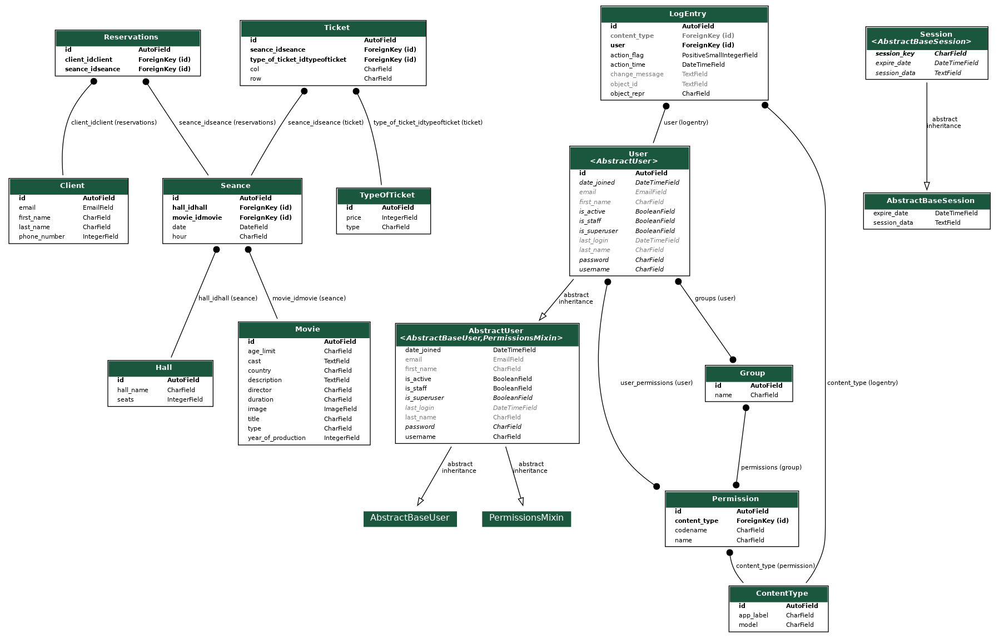

# Cinema-System
## Introduction
A cinema system design that builds on Django 3.1.1.  
Adding movies (data to the database) is done via admin site.
In order to reserve a seat in the cinema, the user must complete the form and select the seat. If successful, an email will be sent.
### Database
Sqlite3
#### Model

## Comments
*You only can "buy" one ticket.
